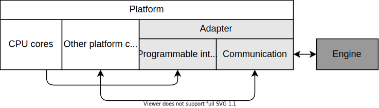
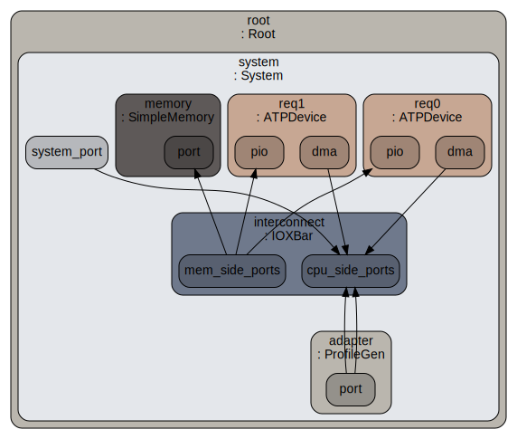

# Programmability

This document describes the design and usage of a programmability layer which can be implemented for adapters of the AMBA ATP Engine (henceforth referred to as the Engine) when integrated with a Host Platform (henceforth referred to as the Platform).

This repository provides an official implementation of a programmability layer for the [gem5](https://github.com/gem5/gem5) adapter.

[toc]

# Introduction

The Engine can be integrated with the Platform through an adapter. The Engine can then send memory requests and receive memory responses from the Platform. The Platform can contain processing elements, particularly CPU cores, from which software can program the behaviour of the hardware components in the Platform.

Programmability enables run-time control of the Engine traffic generation. A user can configure the properties of traffic profiles from an application running in a CPU core, and trigger traffic generation on demand. This enables traffic generation to be subject to software interactions, for example application dependencies.

A programmability layer is optional in an adapter. The integration of the Engine with the Platform through a non-programmable adapter still supports static configuration of traffic generation. Adding a programmability enables dynamic (run-time) traffic generation on top of static traffic generation.



# Programmers model

## Overview

The Engine supports traffic generation by modelling one or more requester devices. The programmability layer exposes each requester as a programmable device. A set of registers is defined to program each requester. Access to registers is based on Memory-mapped I/O (MMIO). Each requester drives an interrupt source to notify a CPU core of completion of a traffic generation operation.

Adapter implementations choose where to locate registers and interrupt sources. Options include:

- A single adapter component is implemented. All sets of registers and interrupt sources are part of the component.
- In addition to the adapter component, one or more requester components are implemented. Each requester component implements its set of registers and interrupt source. Requester components can be distributed across the platform layout.

Distributed requesters can be relevant if the latency for programming registers is of interest, as the distance and hence access cost from a CPU core to a requester will differ. This applies similarly to accesses from the requester to the Platform main memory.

The adapter integration API enables stream management operations. A stream is a chained sequence of one or more traffic profiles. Each stream is identified by a unique name, known as root profile name. A stream can consist of read traffic, write traffic or both. The Engine supports cloning of streams to avoid users having to redefine the same stream multiple times in ATP files. The Engine uses unique 64-bit wide stream identifiers to internally distinguish between streams, including stream clones. Each stream clone is independently programmable.

For consistency, the programmability layer also defines stream APIs. The traffic generated by a stream will target one or more memory regions. Particularly, a stream with read and write traffic can configure an independent memory region for each type of traffic. It is also possible to have a single memory region for both types of traffic.

### Memory region restrictions

Any memory region must be programmable into the requester as a tuple of base address and range. This means the requester view of the memory region is contiguous. If the requester accesses physical memory directly, the physical memory region must be contiguous.

Alternatively, adapter implementations may support generation of SMMU stream IDs and substream IDs. If a requester is subject to an SMMU, software must map the memory region through the SMMU and program the contiguous virtual memory region address and range. This virtual memory region can correspond to a discontiguous physical memory region. The addresses will then be translated by the SMMU.

### Identifying traffic across the system

It is possible to program a unique identifier to be propagated in transactions from a particular traffic stream across the system. This is known as the task identifier, and it is 32 bits wide. This is not to be confused with the unique stream ID internal to the Engine. A system-wide unique task ID enables metric aggregation and service differentiation in system components with such capabilities.

For example, it is possible to use the task ID to decide which portion of a cache can a traffic stream allocate into. Similarly, it is possible to measure the amount of memory bandwidth used by a particular traffic stream by filtering the metric by its task ID.

### Asynchronous request completion

There is no functional constraint on the number of simultaneous traffic streams active within the Engine at a given time. It is however not possible for a given stream to be active more than once simultaneously. Traffic properties between traffic streams can differ, leading to different completion times. Hence, a request for a short traffic stream issued after a request for a long traffic stream may complete earlier than the latter.

Furthermore, adapter implementations can choose to exert some constraints, for example based on the parallelism properties of a requester. This can lead to particular requests being delayed until constraints are satisfied.

The programmers model relies on unique request identifiers to record individual request lifetimes within the adapter. Each request identifier is a 32-bit postive integer. Software generates request identifiers and provides them to the adapter through IN_REQUEST_ID register on request. Adapter implementations can choose how to generate request IDs. Two request IDs must be unique within a requester, but not among requesters. On request completion, the adapter uses the same identifier and writes it to OUT_REQUEST_ID register. The separation of registers enables idependent paths for issuing new requests and notifying completed requests.

### Notification mechanisms

The programmers model supports two notification mechanisms to inform software about state of operations:

#### STATUS register

At the beginning of an operation, the STATUS register has a value of 0. The adapter sets STATUS to 1 on operation completion. Software polls the STATUS register until it becomes 1. Software must set STATUS to 0 once it handles the operation completion to acknowledge the notification.

#### Interrupt source

The adapter asserts an interrupt source on operation completion. This is particularly useful to support [Asynchronous request completion](#asynchronous-request-completion). Software must write 0b10 to CONTROL[3:2] once it handles the interrupt to acknowledge it.

### Discovery

Each device implementing the programmers model can be discovered by software through a standard [DeviceTree](https://www.devicetree.org/) entry. The format of this entry is as follows:

```
atpdevice@BASE_ADDR {
    reg = <0x0 BASE_ADDR 0x0 0x1000>;
    interrupts = <0x0 INT_NUM 0x4>;
    compatible = "arm,atpdevice";
    iommus = <SID 0x0>;
    atp-id = ATP_ID;
};
```

The final DeviceTree configuration should include a device entry for each device to be exposed to software. See ATPDevice [Instantiation](#instantiation) for an example.

## Operations

The programmers model exposes two main operations for software:

1. Creation of a unique instance of a stream within the Engine and retrieval of its associated identifier
2. Configuration of memory regions and activation of a stream in the Engine

### Creation of a unique stream

This operation relies on the *uniqueStream* API from the adapter. The operation flow is as follows:

1. Software allocates a memory region and writes the root profile name associated to the stream into it. The memory region is subject to [Memory region restrictions](#memory-region-restrictions). A basic implementation can use ASCII encoding to exchange the root profile name. Adapter implementations are free to encode the root profile name in other ways.
2. Software writes the memory region base address and range to STREAM_NAME_BASE and STREAM_NAME_RANGE registers, respectively. If using ASCII, the range corresponds to the number of characters in the name.
4. Software writes 0b11 to CONTROL[3:2]. This triggers the unique stream operation.
5. The operation relies on the [STATUS register](#status-register) mechanism for the adapter to notify software when a new unique stream identifier is available in the STREAM_ID register. Software reads the STREAM_ID register and acknowledges the notification.

### Configuration and activation of a stream

This operation relies on the *addressStreamReconfigure* and *scheduleUpdate* APIs from the adapter. These together constitute a play stream operation. The operation flow is as follows:

1. Software allocates memory regions for the stream to read from or write to or both. The memory regions are subject to [Memory region restrictions](#memory-region-restrictions).
2. Software writes the memory region base address and range for read traffic, if any, to READ_BASE and READ_RANGE registers, respectively. Similarly for write traffic, if any, using WRITE_BASE and WRITE_RANGE registers.
3. Software writes the type of traffic to be configured for the stream into CONTROL[1:0]. The types of traffic are describe in [CONTROL register](#control).
5. Software writes the unique stream ID to STREAM_ID register. This has been previously obtained from [Creation of a unique stream](#creation-of-a-unique-stream).
6. Software can write the unique task ID to TASK_ID register. If no write occurs to this register, the previous value of TASK_ID is used.
7. Software generates a unique request ID, which uniquely identifies the current operation request. Software writes the request ID to IN_REQUEST_ID register.
8. Software writes 0b01 to CONTROL[3:2]. This triggers the play stream operation.
9. The operation relies on the [STATUS register](#status-register) mechanism for the adapter to notify software when the new request is recorded. The request may be activated immediately or be delayed, depending on the state of the requester. Software acknowledges the notification.
11. Software waits for the traffic generation to complete. Software implementations can choose the characteristics of this wait. For example, it can involve doing other work or transitioning the process state to idle.
12. On traffic generation completion, the adapter writes the completed request ID to OUT_REQUEST_ID register and relies on the [Interrupt source](#interrupt-source) mechanism to notify software. Software reads OUT_REQUEST_ID register and acknowledges the notification.

## Registers

Registers are accessed based on MMIO. Each programmable requester is statically configured with a base physical memory address. This address depends on the Platform memory map. Registers start at offset 0x0 from the base address and span an entire 4 KiB memory page, resulting in a register range of [BASE_ADDR : BASE_ADDR + 0x1000]. The register characteristics are as follows:

| Offset | Name              | Type | Width | Reset |
| :----- | :---------------- | :--- | ----- | ----- |
| 0x00   | STREAM_NAME_BASE  | WO   | 64    | -     |
| 0x08   | STREAM_NAME_RANGE | WO   | 64    | -     |
| 0x10   | READ_BASE         | WO   | 64    | -     |
| 0x18   | READ_RANGE        | WO   | 64    | -     |
| 0x20   | WRITE_BASE        | WO   | 64    | -     |
| 0x28   | WRITE_RANGE       | WO   | 64    | -     |
| 0x30   | STREAM_ID         | RW   | 64    | -     |
| 0x38   | TASK_ID           | WO   | 32    | 0     |
| 0x3C   | IN_REQUEST_ID     | WO   | 32    | -     |
| 0x40   | OUT_REQUEST_ID    | RO   | 32    | -     |
| 0x44   | CONTROL           | WO   | 8     | 0     |
| 0x45   | STATUS            | RW   | 8     | 0     |

### STREAM_NAME_BASE

Base address of the memory region containing the root profile name identifying the stream. See [Memory region restrictions](#memory-region-restrictions).

Software must write to it as input for [Creation of a unique stream](#creation-of-a-unique-stream).


### STREAM_NAME_RANGE

Size or range in bytes of the memory region containing the root profile name identifying the stream.

Software must write to it as input for [Creation of a unique stream](#creation-of-a-unique-stream).


### READ_BASE

Base address of the memory region accessed by read traffic from the stream. See [Memory region restrictions](#memory-region-restrictions).

Software may write to it as input for [Configuration and activation of a stream](#configuration-and-activation-of-a-stream).


### READ_RANGE

Size or range in bytes of the memory region accessed by read traffic from the stream.

Software may write to it as input for [Configuration and activation of a stream](#configuration-and-activation-of-a-stream).


### WRITE_BASE

Base address of the memory region accessed by write traffic from the stream. See [Memory region restrictions](#memory-region-restrictions).

Software may write to it as input for [Configuration and activation of a stream](#configuration-and-activation-of-a-stream).


### WRITE_RANGE

Size or range in bytes of the memory region accessed by write traffic from the stream.

Software may write to it as input for [Configuration and activation of a stream](#configuration-and-activation-of-a-stream).


### STREAM_ID

Unique identifier for the stream within the Engine.

Software must write to it as input for [Configuration and activation of a stream](#configuration-and-activation-of-a-stream).

Software must read from it as output from [Creation of a unique stream](#creation-of-a-unique-stream).


### TASK_ID

Unique identifier for the stream across the system. See [Identifying traffic across the system](#identifying-traffic-across-the-system).

Software may write to it as input for [Configuration and activation of a stream](#configuration-and-activation-of-a-stream).


### IN_REQUEST_ID

Unique identifier of a new request operation within a requester. See [Asynchronous request completion](#asynchronous-request-completion).

Software must write to it as input for [Configuration and activation of a stream](#configuration-and-activation-of-a-stream).


### OUT_REQUEST_ID

Unique identifier of a completed request operation within a requester. See [Asynchronous request completion](#asynchronous-request-completion).

Software must read from it as output from [Configuration and activation of a stream](#configuration-and-activation-of-a-stream).


### CONTROL

Main control register to trigger operations through the adapter.

Software must write to it as input for all operations.


| Bits  | Name | Description                                                  |
| ----- | ---- | ------------------------------------------------------------ |
| [3:2] | OP   | Type of operation to trigger in the adapter<br />0b01: [Configuration and activation of a stream](#configuration-and-activation-of-a-stream).<br />0b10: Interrupt acknowledgement.<br />0b11: [Creation of a unique stream](#creation-of-a-unique-stream). |
| [1:0] | RW   | Type of traffic to configure for the stream<br />0b00: Read only.<br />0b01: Write only.<br />0b11: Read and write. |

### STATUS

Status register for poll-based notification mechanism. See [STATUS register](#status-register) notification mechanism.


# Adapter implementations

## ATPDevice gem5 model

The gem5 adapter, known as ProfileGen, was introduced in the initial release of the AMBA ATP Engine under `gem5/`. The Engine version 3.1 introduces a complementary and optional programmability layer implementation for the gem5 adapter, known as the ATPDevice.

The ATPDevice is a gem5 model representing a device with DMA and interrupt capabilities. ATPDevice implements the register layout as described in [Registers](#registers). Each ATPDevice is associated to an internal Engine requester. This means a simulation often consists of one ProfileGen model and as many ATPDevice models as Engine requesters.

The following is a configuration diagram with two ATPDevices and one ProfileGen adapter:



Profilegen request `port`s generate traffic into the system interconnect. ATPDevice `dma` request ports are used to read the root profile name. ATPDevice `pio` ports respond to MMIO register accesses. 

### Configuration parameters

The following are main parameters available to configure from the ATPDevice Python interface:

| Parameter | Type            | Definition                                                   |
| --------- | --------------- | ------------------------------------------------------------ |
| pio_addr  | Addr            | Base physical address of the register layout.                |
| interrupt | ArmInterruptPin | Wired interrupt pin assigned to this requester. This should most times be a GIC SPI. The interrupt number must be within the range supported by the GIC. |
| sid       | Unsigned        | SMMU Stream ID assigned to transactions from this requester. |
| atp_id    | UInt32          | Requester unique identifier within the Engine. This must be the same as "master_id" for that requester in ATP configuration files (.atp files). |

### Instantiation

This is an example of how to instantiate an ATPDevice accessible from base address 0x20000000, with SPI 64, Stream ID 0x1 and corresponding to Engine requester REQ0:

```python
system = System(...)
system.adapter = ProfileGen(...)
system.requester = ATPDevice(adapter=system.adapter,
                             pio_addr=0x20000000,
                             interrupt=ArmSPI(num=64),
                             sid=0x1,
                             atp_id="REQ0")
```

Each ATPDevice can auto-generate a standard DeviceTree entry as defined in [Discovery](#discovery). DeviceTree auto-generation is a gem5 feature, and it is out of the scope of this document. The following is an entry corresponding to the example above:

```
atpdevice@0x20000000 {
    reg = <0x0 0x20000000 0x0 0x1000>;
    interrupts = <0x0 0x40 0x4>;
    compatible = "arm,atpdevice";
    iommus = <0x1 0x0>;
    atp-id = "REQ0";
};
```

### Implementation details

ATPDevice expects root profile names to be encoded in ASCII. A root profile name is written by software into a memory region. Access to this memory region is programmed in ATPDevice by writing into STREAM_NAME_BASE and STREAM_NAME_RANGE registers. ATPDevice reads the root profile name from the memory region by issuing one or more memory read requests the size of the system cache line, often 64 bytes. Note the ATPDevice request port is only used for reading the root profile name. The actual traffic is generated through ProfileGen request ports.

The following is an example of port connections:

```python
interconnect = ...
adapter = ProfileGen(...)
requesters = [ATPDevice(atp_id="REQ0", ...), ATPDevice(atp_id="REQ1", ...)]
for requester in requesters:
    # Connect the ATPDevices request ports and register access response ports
    # The requester port is used to read the root profile name
    requester.dma = interconnect.cpu_side_ports
    requester.pio = interconnect.mem_side_ports
    # Connect the ProfileGen request ports, used to generate actual traffic
    adapter.port = interconnect.cpu_side_ports
```

ProfileGen does not impose additional constraints on the number of simultaneously active traffic streams. When a request for traffic stream activation is programmed for an ATPDevice, it is immediately served to the adapter unless it corresponds to a stream which is already active within the Engine. In the latter case, the request is buffered until the current stream activation completes.

ATPDevice supports independent configuration of memory regions for read and write traffic. ATPDevice also annotates requests generated by the adapter. It annotates the SMMU Stream ID, SMMU SubStream ID and Task ID. The former two are inspected by the SMMU if there is one in the system.

ATPDevice interrupt pin is connected to the interrupt controller, that is the GIC. It is possible for software to program the attributes of the ATPDevice interrupt following the GIC programmers model. These include group, priority and target CPU core.

# Software implementations

This repository provides a software implementation to drive any adapter implementation compliant with the [Programmers model](#programmers-model). The implementation is based on Linux kernel modules and it is provided under the `linux/` subdirectory. The implementation consists of:

- Device kernel module. Software layer to access the [Programmers model](#programmers-model). See [Device module](#device-module).
- Buffer manager kernel module. Allocation and sharing of memory buffers between CPU cores and ATP requesters. See [Buffer manager module](#buffer-manager-module).
- C user API under `linux/uapi/`. Easy to use APIs to access the kernel modules functionality. See [User API](#user-api).
- C++ test suite under `linux/test/`. Integration tests verifying kernel modules functionality. See [Test suite](#test-suite).

## Kernel modules

The software implementation consists of two external or out-of-tree kernel modules.

### Building the modules

Conventionally, the machine where software to be deployed is built, including the kernel modules, is the host, and the machine where software is deployed is the target. The modules should be built against the Linux kernel version to be deployed in the target. The Linux kernel must be built before the kernel modules. If host and target are the same machine, it is possible to build the modules against the running kernel. For more details, see the official documentation on [Building External Modules](https://www.kernel.org/doc/html/latest/kbuild/modules.html).

The following is an example of how to build the modules:

```bash
make -C $workspace/ATP-Engine/linux \
     KERNEL_SRC=$workspace/linux CROSS_COMPILE=aarch64-none-linux-gnu- modules
```

This produces kernel object ( `.ko`) files under the modules source directory. Kernel object files can be loaded into the Linux kernel either automatically on boot or manually. Loading of kernel object files is out of the scope of this document.

### Interfacing with the modules

The kernel modules expose Input/output control (IOCTL) interfaces. Applications can interact with the modules by issuing [ioctl](https://man7.org/linux/man-pages/man2/ioctl.2.html) system calls, and providing the request code and required input. See [Device module interface](#device-module-interface) and [Buffer manager module interface](#buffer-manager-module-interface) for specific codes and input. Following the convention, the IOCTL calls return a negative integer if an error occurs in the module, and zero on success.

The kernel modules belong to the [character device driver](https://www.oreilly.com/library/view/linux-device-drivers/0596005903/ch03.html) class. These are exposed within Linux under `/dev`. The buffer manager module is exposed as `/dev/atpbuffer`. The device module exposes as many entries under `/dev` as devices it manages. Each managed device is exposed as `/dev/atp<ATP_ID>`, where ATP_ID is extracted from the DeviceTree entry, defined in [Discovery](#discovery). For example, a device with ATP_ID = "REQ0" is exposed as `/dev/atpREQ0`.

Each kernel module provides a private header and a user or public header. Public headers have the `_user.h` suffix. Public headers define the IOCTL request codes and input/output data types. Applications can include a module public header to interact with the associated module via IOCTL. This is an example of a C application interfacing with the device module to generate a unique stream:

```c
// other headers
#include "atp_device_user.h"

uint64_t get_unique_stream(int device_module_fd) {
    struct atp_data_unique_stream data;
    data.atp_stream_name = "MY_STREAM";
    if (ioctl(device_module_fd, ATP_UNIQUE_STREAM, &data))
        // error
    return data.atp_stream_id;
}
```

Applications can also use the [User API](#user-api), which abstracts the ioctl calls into high-level C APIs. The same example using the user API is written as follows:

```c
// other headers
#include "atp.h"

uint64_t get_unique_stream(int device_module_fd) {
    uint64_t stream_id;
    if (atp_device_unique_stream(device_module_fd, "MY_STREAM", &stream_id))
        // error
    return stream_id;
}
```

### Management of memory regions

Both the device module and buffer manager module manage memory regions through the Linux [dma-buf](https://www.kernel.org/doc/html/latest/driver-api/dma-buf.html) subsystem. This subsystem enables memory regions to be safely shared between different devices and CPU cores. This in turn enables more efficient usage of memory, as the same region can be safely mapped to different address spaces, avoiding unnecessary copies.

Each memory region or buffer is uniquely identified within the operating system by a Linux file descriptor (FD). The modules provide the buffer FDs to application software. Applications can provide FDs to both kernel modules. For example, an application can provide buffer FDs to the device module to indicate which buffers to use in traffic generation operations. It is possible to transmit buffer FDs between different applications. See [Transmission of buffer file descriptors](#transmission-of-buffer-file-descriptors).

Several operations along with operation conditions are defined over a memory buffer:

| Operation         | API context                                                  | Description                                                  | Conditions                                                   |
| ----------------- | ------------------------------------------------------------ | ------------------------------------------------------------ | ------------------------------------------------------------ |
| Allocation        | ATP_GET_BUF in [Buffer manager module interface](#buffer-manager-module-interface). | Reservation of an amount of physical memory bytes for a buffer. | -                                                            |
| Device attachment | ATP_ATTACH_BUFFER in [Device module interface](#device-module-interface). | Set a device as a user of a buffer. The device can now access the buffer. | Multiple devices can be attached at a given time to the same buffer. A device can be attached to multple buffers at a given time. |
| Device detachment | ATP_DETACH_BUFFER in [Device module interface](#device-module-interface). | Unset a a device as a user of a buffer. The device can no longer access the buffer. | -                                                            |
| Device mapping    | ATP_PLAY_STREAM in [Device module interface](#device-module-interface). | Make a buffer accessible from the address space of an ATP device. | A buffer can be mapped to multiple devices address spaces at a given time. Subject to an SMMU if any on the system. |
| CPU mapping       | Call to [mmap](https://man7.org/linux/man-pages/man2/mmap.2.html) on the buffer file descriptor. | Make a buffer accessible from the address space of a CPU process. | A buffer can be mapped to multiple CPU processes address spaces at a given time. See [Accessing buffers from CPU processes](#accessing-buffers-from-cpu-processes). |
| Release           | ATP_PUT_BUF in [Buffer manager module interface](#buffer-manager-module-interface). | Free the physical memory reserved for a buffer.              | -                                                            |

### Device module

The device module (`atp_device`) enables interaction with the [Programmers model](#programmers-model). It implements the device attachment, detachment and mapping operations defined in [Management of memory regions](#management-of-memory-regions). It supports managing multiple devices. There is no functional limit to how many devices can be managed at once. This is to support configurations with considerable number of Engine requesters.

#### Device module interface

The device module supports the following IOCTL interfaces, as defined in `atp_device_user.h`:

| Request code      | Data exchange                               | Description                                                  |
| ----------------- | ------------------------------------------- | ------------------------------------------------------------ |
| ATP_ATTACH_BUFFER | Buffer file descriptor [int]                | Attaches the device to a memory buffer allocated through the [Buffer manager module](#buffer-manager-module). |
| ATP_DETACH_BUFFER | Buffer file descriptor [int]                | Detaches the device from a memory buffer allocated through the [Buffer manager module](#buffer-manager-module). |
| ATP_PLAY_STREAM   | Play stream data [atp_data_play_stream]     | Triggers [Configuration and activation of a stream](#configuration-and-activation-of-a-stream). |
| ATP_UNIQUE_STREAM | Unique stream data [atp_data_unique_stream] | Triggers [Creation of a unique stream](#creation-of-a-unique-stream). |

| Data type                     | Fields                                                       |
| ----------------------------- | ------------------------------------------------------------ |
| struct atp_data_play_stream   | atp_stream_id: unique ID of the stream to play.<br />flow_id: task ID for the stream. See [Identifying traffic across the system](#identifying-traffic-across-the-system).<br />read_fd (optional): file descriptor of memory region for read traffic, if any.<br />write_fd (optional): file descriptor of memory region for write traffic, if any. |
| struct atp_data_unique_stream | atp_stream_name: Engine requester name, same as "master_id".<br />atp_stream_id (output): new unique ID for the stream. |

#### Device module implemetation details

Each device managed by the device module can be independently programmed, that is, two programming requests to two different devices do not interfere. The device module provides data structures for each managed device.

For each device, the module keeps a list of traffic generation requests, also known as play requests, which are pending for completion. Request IDs, as introduced in [Asynchronous request completion](#asynchronous-request-completion), are generated from a value of 1 with an increment of 1 between generated requests. The maximum request ID is the maximum unsigned 32-bit integer value, after which the next request ID will restart from value 1.

While waiting for a request completion, as introduced in [Configuration and activation of a stream](#configuration-and-activation-of-a-stream), the calling process is put to sleep in a [wait queue](https://www.oreilly.com/library/view/linux-device-drivers/0596000081/ch05s02.html) associated to the pending request. On reception of the device interrupt, the device module interrupt service routine (ISR) reads the completed request ID from OUT_REQUEST_ID, and wakes up the process slept in its associated wait queue.

Discovery of devices through standard DeviceTree entries as defined in [Discovery](#discovery) is fully supported.

[Spinlocks](https://www.kernel.org/doc/html/latest/kernel-hacking/locking.html?highlight=locking#locking-in-the-linux-kernel) are used to protect critical regions where ATPDevice registers are accessed and for short-lived operations, such as addition or deletion from request queues.

### Buffer manager module

The buffer manager module (`atp_buffer_manager`) enables allocation and sharing of memory regions, also known as buffers, between ATP devices and CPU cores. It implements the allocation and release operations defined in [Management of memory regions](#management-of-memory-regions).

#### Buffer manager module interface

The buffer manager module supports the following IOCTL interfaces, as defined in `atp_buffer_manager_user.h`:

| Request code | Data exchange                      | Description                                                  |
| ------------ | ---------------------------------- | ------------------------------------------------------------ |
| ATP_GET_BUF  | Get buffer data [atp_data_get_buf] | Allocates a buffer and retrieves its unique file descriptor. |
| ATP_PUT_BUF  | Buffer file descriptor [int]       | Deallocates a buffer memory region.                          |

| Data type               | Fields                                                       |
| ----------------------- | ------------------------------------------------------------ |
| struct atp_data_get_buf | size: number of bytes to allocate for the buffer.<br />fd (output): resulting unique file descriptor for the buffer.<br />contig: specifies the buffer to be physically contiguous in memory. See [Buffer manager module implementation details](#buffer-manager-module-implementation-details). |

#### Buffer manager module implementation details

The buffer manager can allocate memory regions of arbitrary size. Linux has a functional limit on the size of contiguous allocations. Contiguous allocations of more than 4 MiB can't often be met by the default allocator. Unless `contig` is provided in an ATP_GET_BUF request, the buffer manager will allocate a memory region with no guarantee for it to be physically contiguous, possibly scattered across physical memory. It then relies on an SMMU mapping over this region to provide a contiguous view for ATP devices.

## User API

A high-level user API (UAPI) implemented in C is provided under `linux/uapi`. The UAPI is intended for use as a library by C or C++ applications which want to manage ATP devices. It abstracts the majority of system calls, including IOCTL and mmap. See [atp.h](linux/uapi/atp.h) for documentation on all APIs.

It is possible to build the library both as static (`libatp.a`) or dynamic (`libatp.so`). Applications can then link against the library by using the `-latp` flag, assuming the ATP library is within the library path.

### Building the user API

The user API build relies on the DMA-BUF user-space header. By default, the user API Makefile will try to find it inside the system-wide header path (`/usr/include`) . Often, the target kernel version will differ from the running kernel version. In that case, the header must be produced via [make headers_install](https://www.kernel.org/doc/html/latest/kbuild/headers_install.html). The path to the headers installation path must be passed when building the user API via `KERNEL_HDR_PATH`. For example, suppose headers are installed in `$workspace/kernel_headers`:

```bash
make -C $workspace/ATP-Engine/linux/uapi \
    KERNEL_HDR_PATH=$workspace/kernel_headers CC=aarch64-none-linux-gnu-gcc all
```

### Accessing buffers from CPU processes

Suppose a buffer allocated through the buffer manager module:

```c++
size_t buffer_size = ...;
int buffer_fd = atp_buffer_allocate(...);
```

Applications can map this buffer by calling mmap on its file descriptor. Additionally, before and after accessing the mapped buffer, the process must issue [special IOCTL calls](https://www.kernel.org/doc/html/latest/driver-api/dma-buf.html#cpu-access-to-dma-buffer-objects):

```c++
void *buffer = mmap(NULL, buffer_size, PROT_READ | PROT_WRITE, MAP_SHARED, buffer_fd, 0);
struct dma_buf_sync sync;
sync.flags = DMA_BUF_SYNC_START | DMA_BUF_SYNC_RW;
ioctl(buffer_fd, DMA_BUF_IOCTL_SYNC, &sync);
// Proceed with access
memset(buffer, ...);
sync.flags = DMA_BUF_SYNC_END | DMA_BUF_SYNC_RW;
ioctl(buffer_fd, DMA_BUF_IOCTL_SYNC, &sync);
```

The UAPI facilitates interfaces for this process as follows:

```c++
void *buffer = atp_buffer_cpu_get(buffer_fd, buffer_size);
atp_buffer_cpu_begin(buffer_fd);
// Proceed with access
memset(buffer, ...);
atp_buffer_cpu_end(buffer_fd);
```

### Transmission of buffer file descriptors between CPU processes

CPU processes can share buffer file descriptors (FD) among each other. This is useful if a workload is distributed among multiple processes which access a common set of buffers. Transmission of buffer FDs is a user space process, that is, it does not involve the kernel modules.

The UAPI implementation of buffer FD transmission is based on [UNIX domain sockets](https://en.wikipedia.org/wiki/Unix_domain_socket). Particularly it uses [ancillary data](https://man7.org/linux/man-pages/man3/cmsg.3.html) to transport the FD across the socket. It provides two interfaces for this process:

```c++
/* BOTH PROCESSES */

// Both sender and receiver agree on a socket path
const char *socket_path = "/tmp/fd_trans";

/* SENDER PROCESS */

// Sender process owns the original buffer FD
int buffer_fd = ...;
// Sender transmits the buffer FD through the socket
atp_buffer_send(socket_path, buffer_fd);

/* RECEIVER PROCESS */

// Receiver blocks until the buffer is received through the socket
int buffer_fd = atp_buffer_receive(socket_path);
```

The receiver can then use the buffer file descriptor on interacting with kernel modules. Note the sender can continue using the same file descriptor, which is now effectively shared.

## Test suite

An integration test suite written in C++ is provided under `linux/test`. This is intended to run within a target system in which the ATP kernel modules are already loaded. It uses the standard UAPI to verify the main functionality provided by the kernel modules, the underlying adapter implementation and the UAPI itself. The test suite does not stress performance.

The test suite relies on the [CppUnit](https://freedesktop.org/wiki/Software/cppunit/) C++ library, which is also used for the Engine test suite at the top-level of the directory. The default test binary name resulting from build is `test_atp.out`.

Users can run all tests from a target shell session by executing the binary with no arguments (`./test_atp.out`). It is also possible to run a single test or a subset of them by providing a regular expression matching the tests to execute. For example, to run only tests related to [Configuration and activation of a stream](#configuration-and-activation-of-a-stream), execute `./test_atp.out Play`.
